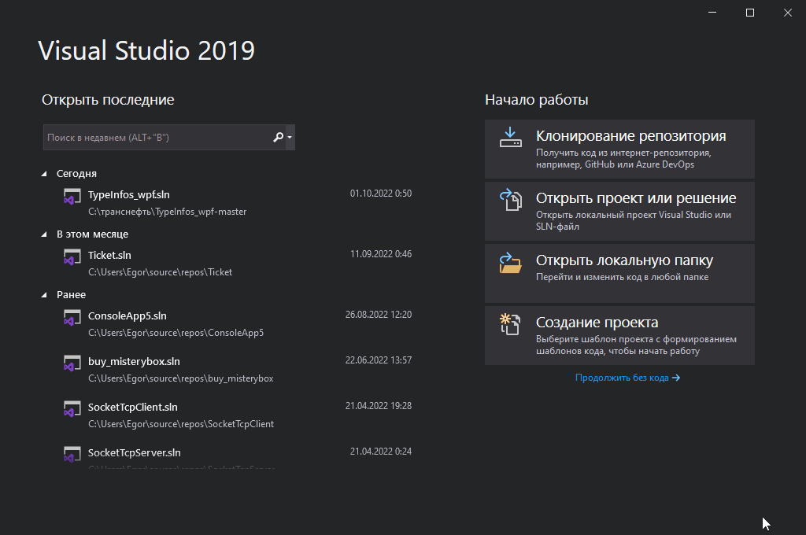
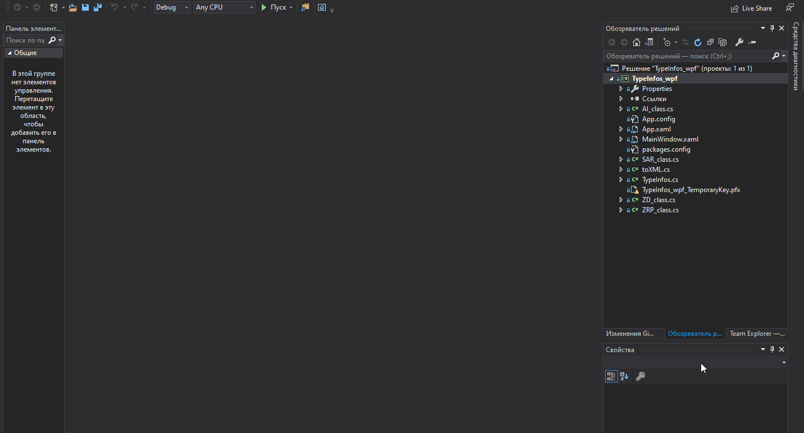

# CandidateTest
README по запуску проекта:

1. Открыть Visual Studio.

2. Выполнить клонирование (инструкция в gif ниже) по ссылке https://github.com/dodo-eth/TypeInfos_wpf or https://gitlab.com/off_fov/TypeInfos_wpf


3. Выполнить запуск по инструкции в gif.



Полученые значение сохраняются в формате XML по шаблону:

```xml
<item Binding="Introduced">
    <node-path>{{ tag }}</node-path>
    <address>{{ offset }}</address>
</item>
```

Спасибо!